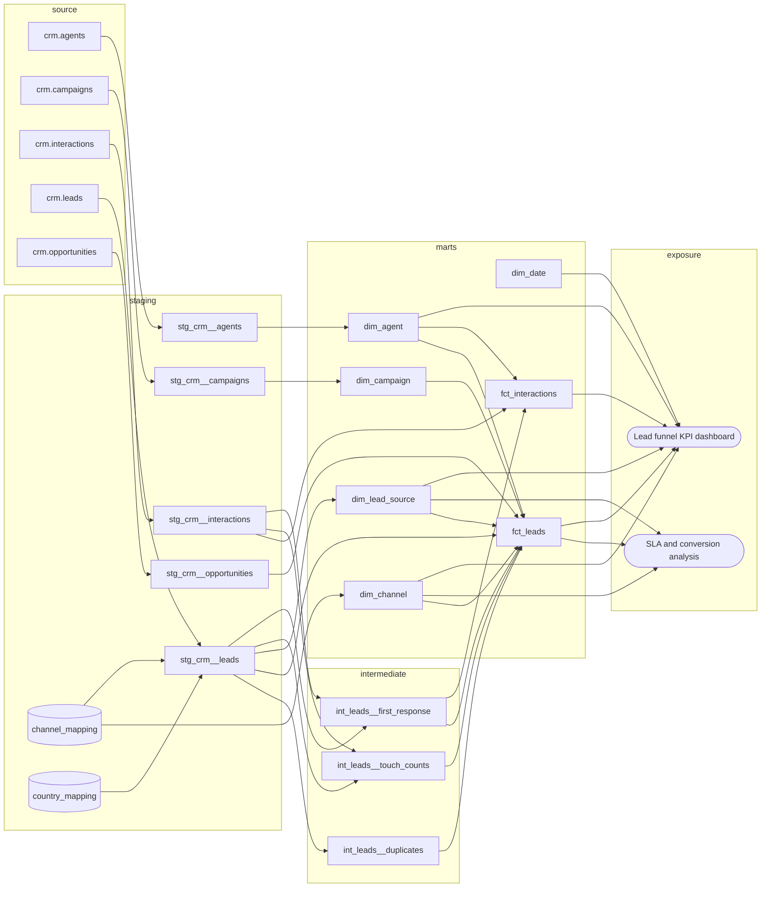

# dbt lineage

> Generated by `scripts/dbt_lineage.py` from `dbt/target/manifest.json` — do not edit.
> Cylinders are seeds; rounded boxes are exposures (consumers).

```mermaid
flowchart LR
    subgraph source
        n19["crm.agents"]
        n20["crm.campaigns"]
        n21["crm.interactions"]
        n22["crm.leads"]
        n23["crm.opportunities"]
    end
    subgraph staging
        n12["stg_crm__agents"]
        n13["stg_crm__campaigns"]
        n14["stg_crm__interactions"]
        n15["stg_crm__leads"]
        n16["stg_crm__opportunities"]
        n17[("channel_mapping")]
        n18[("country_mapping")]
    end
    subgraph intermediate
        n9["int_leads__duplicates"]
        n10["int_leads__first_response"]
        n11["int_leads__touch_counts"]
    end
    subgraph marts
        n2["dim_agent"]
        n3["dim_campaign"]
        n4["dim_channel"]
        n5["dim_date"]
        n6["dim_lead_source"]
        n7["fct_interactions"]
        n8["fct_leads"]
    end
    subgraph exposure
        n0(["Lead funnel KPI dashboard"])
        n1(["SLA and conversion analysis"])
    end
    n10 --> n7
    n10 --> n8
    n11 --> n8
    n12 --> n2
    n13 --> n3
    n14 --> n10
    n14 --> n11
    n14 --> n7
    n15 --> n10
    n15 --> n11
    n15 --> n6
    n15 --> n8
    n15 --> n9
    n16 --> n8
    n17 --> n15
    n17 --> n4
    n18 --> n15
    n19 --> n12
    n2 --> n0
    n2 --> n7
    n2 --> n8
    n20 --> n13
    n21 --> n14
    n22 --> n15
    n23 --> n16
    n3 --> n8
    n4 --> n0
    n4 --> n1
    n4 --> n8
    n5 --> n0
    n6 --> n0
    n6 --> n1
    n6 --> n8
    n7 --> n0
    n8 --> n0
    n8 --> n1
    n9 --> n8
```
